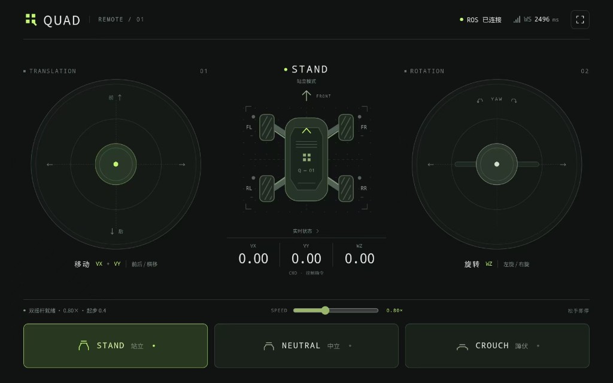

# robot_ws — 四足机械狗 ROS2 工作区

Ubuntu 22.04 · ROS2 Humble · 灵足 RS03（8 关节）+ 大疆 C620 麦轮（can2）

本仓库包含四足本体控制栈（`src/robstride_ros_sample`）、启动脚本（`scripts/`）、参数配置（`config/`），以及手机横屏遥控 Web 端（[`quad_remote/`](quad_remote/)）。

---

## 目录

- [系统概览](#系统概览)
- [硬件与 CAN 接线](#硬件与-can-接线)
- [控制模式说明](#控制模式说明)
- [环境准备与编译](#环境准备与编译)
- [一键启动](#一键启动)
- [手机遥控 QUAD Remote](#手机遥控-quad-remote)
- [ROS 节点与话题](#ros-节点与话题)
- [配置文件](#配置文件)
- [脚本手册](#脚本手册)
- [标定与姿态](#标定与姿态)
- [安全与急停](#安全与急停)
- [日志与排障](#日志与排障)
- [目录结构](#目录结构)
- [相关文档](#相关文档)
- [更新记录](#更新记录)

---

## 系统概览

```
┌─────────────────────────────────────────────────────────────────┐
│  手机浏览器（横屏）  http://<主机IP>:8765/                        │
│       │ WebSocket 50Hz drive + 姿态按钮                           │
└───────┼─────────────────────────────────────────────────────────┘
        ▼
┌───────────────────┐     /cmd_vel          ┌─────────────────────┐
│  quad_remote      │ ───────────────────►  │  quad_teleop_ros2   │
│  server.py        │     /quad/teleop/*    │  cmd_vel → 麦轮 IK   │
│  ros_bridge.py    │ ───────────────────►  │  pose → /quad/goto/*│
└───────────────────┘                       └──────────┬──────────┘
                                                       │
                       /quad/wheels/cmd                │
                              ▼                        │
                    ┌─────────────────┐                │
                    │  c620_quad_ros2 │ ◄──────────────┘
                    │  can2 · 速度PID  │
                    └─────────────────┘

  /quad/goto/{stand,neutral,crouch}
                              ▼
                    ┌─────────────────┐
                    │  quad_rs_ros2   │
                    │  can0+can1      │
                    │  8×RS03 运控模式 │
                    └─────────────────┘
```

| 层级 | 组件 | 作用 |
|------|------|------|
| 遥控 UI | `quad_remote` | 双摇杆 VX/VY/WZ、速度倍率、STAND/NEUTRAL/CROUCH |
| 协调 | `quad_teleop_ros2` | `/cmd_vel` 逆运动学 → 四轮轮速；姿态话题转发 |
| 麦轮 | `c620_quad_ros2` | C620 速度环 + 摩擦补偿 + 双轮同步 |
| 关节 | `quad_rs_ros2` | 8 关节 MIT 类运控 + 梯形轨迹 + 四腿同步 |

**当前在线配置：** 麦轮仅 **leg1 + leg2（FL/FR）** 使能（`active_wheels: [1, 2]`），后两轮软件侧关闭。

---

## 硬件与 CAN 接线

### 电机分布（俯视）

```
        leg4 (左后)          leg3 (右后)
        抬升④  拉杆⑧          抬升③  拉杆⑦
              ┌──────┐
              │ 机身 │
              └──────┘
        抬升①  拉杆⑤          抬升②  拉杆⑥
        leg1 (左前)          leg2 (右前)
```

| 腿 | 位置 | 抬升 RS03 | 拉杆 RS03 | C620 麦轮 |
|----|------|-----------|-----------|-----------|
| leg1 | 左前 FL | 1 | 5 | 1 |
| leg2 | 右前 FR | 2 | 6 | 2 |
| leg3 | 右后 RR | 3 | 7 | 3 |
| leg4 | 左后 RL | 4 | 8 | 4 |

### CAN 总线

| 接口 | 设备 | 电机 ID | ROS 节点 |
|------|------|---------|----------|
| **can0** | 灵足 RS03 抬升 | 1–4 | `quad_rs_ros2` |
| **can1** | 灵足 RS03 拉杆 | 5–8 | `quad_rs_ros2` |
| **can2** | 大疆 C620 + M3508 | 1–4（当前 1–2 在线） | `c620_quad_ros2` |

USB-CAN HUB 启动：

```bash
~/robot_ws/scripts/can-hub-up.sh can0 can1 can2
```

---

## 控制模式说明

### 灵足 RS03 关节 — 运控模式（MIT 同类）

- 底层协议：`move_control_mode`（模式 0），每周期下发 `qDes`、`qdDes`、`Kp`、`Kd`
- 力矩近似：\(\tau \approx K_p(q_{des}-q) + K_d(\dot q_{des}-\dot q)\)
- ROS 层：`quad_rs_ros2` 做 **梯形速度规划**（S 曲线加减速），200Hz 控制环
- 默认刚度/阻尼：`motion_kp: 38.0`，`motion_kd: 3.2`（见 `config/quad_full_params.yaml`）

### 大疆 C620 麦轮 — 速度 PID（非 MIT）

- CAN 反馈：单圈角度 `angle_raw`、转速 `speed_rpm`、电流、温度
- 控制：速度环 PID → 电流指令，含库仑/粘性摩擦前馈与双轮同步
- **无里程计节点**：`/quad/wheel_states` 的 `position` 为单圈编码器角，**非累计里程**

---

## 环境准备与编译

### 依赖

- Ubuntu 22.04
- ROS2 Humble：`/opt/ros/humble/setup.bash`
- CAN 工具：`can-utils`（`cansend`、`ip link`）
- 内核模块：`gs_usb`（USB-CAN HUB）

### 编译

```bash
source /opt/ros/humble/setup.bash
cd ~/robot_ws
colcon build --packages-select rs_motor_ros2
source install/setup.bash
```

### 手机遥控 Python 依赖

```bash
pip install -r ~/quad_remote/requirements.txt
# 或使用仓库内副本
pip install -r ~/robot_ws/quad_remote/requirements.txt
```

---

## 一键启动

### 全栈（推荐）

```bash
~/quad_remote/start-all.sh
```

依次：停旧进程 → 清 FastDDS SHM → 启动 CAN + 三 ROS 节点 → 启动 Web `:8765` → 打印手机 URL。

### 分步启动

```bash
# 1. 停止旧进程（可选）
pkill -f quad_remote/server.py 2>/dev/null || true
~/robot_ws/scripts/run-quad-all.sh stop

# 2. ROS 环境
source /opt/ros/humble/setup.bash
source ~/robot_ws/install/setup.bash
source ~/robot_ws/scripts/ros-env.sh

# 3. 机器人节点（含 CAN）
~/robot_ws/scripts/run-quad-all.sh

# 4. 手机遥控 Web
~/quad_remote/run.sh --host 0.0.0.0 --port 8765

# 5. 健康检查
curl -s http://127.0.0.1:8765/health | python3 -m json.tool
hostname -I | awk '{print "http://" $1 ":8765/"}'
```

### 上电后建议站起

```bash
~/robot_ws/scripts/quad-goto-pose.sh stand
```

### 停止

```bash
pkill -f quad_remote/server.py
~/robot_ws/scripts/run-quad-all.sh stop
```

---

## 手机遥控 QUAD Remote

横屏双摇杆界面（`QUAD · REMOTE / 01`），无需安装 App，手机浏览器即可。



### 界面功能

| 区域 | 功能 |
|------|------|
| **TRANSLATION 左摇杆** | 前进/后退 **VX**、左右横移 **VY** |
| **ROTATION 右摇杆** | 原地左旋/右旋 **WZ** |
| **中央 CMD** | 实时显示 VX / VY / WZ 指令值 |
| **机器人俯视图** | FL/FR/RL/RR 四轮速度指示；点击进入详细遥测 |
| **SPEED 滑条** | 速度倍率 **0.40× ~ 1.50×**（默认 0.80×），持久化到 sessionStorage |
| **STAND / NEUTRAL / CROUCH** | 整机姿态切换（经 `/quad/teleop/{stand,neutral,crouch}`） |
| **顶部状态** | ROS 连接、WebSocket 延迟 (ms)、全屏 |
| **松手即停** | 摇杆回中后自动发零速；离开页面/断线也会 stop |

### 使用注意

1. **必须横屏**；竖屏会显示提示并禁止驱动
2. 打开详情面板时会暂停驱动（防误触）
3. 多页面同时打开时，**最新连接的页面**获得控制权
4. 首次使用若轮速偏弱，可调大 SPEED 或检查 `c620_quad_params.yaml` 摩擦/电流参数

### 实时性参数

| 环节 | 频率/策略 |
|------|-----------|
| 浏览器发 drive | 50 Hz（rAF + 20ms 节流） |
| WebSocket → ROS | 非阻塞处理；ping 异步回复 |
| `ros_bridge` 发 `/cmd_vel` | 50 Hz |
| `quad_teleop` 发轮速 | 100 Hz |
| 状态下发（轻量/全量） | 5 Hz / 每 4 秒含 joints+wheels |

详见 [`quad_remote/README.md`](quad_remote/README.md)。

---

## ROS 节点与话题

### 节点

| 节点 | 包/可执行文件 | 说明 |
|------|---------------|------|
| `quad_rs_node` | `quad_rs_ros2` | 8 关节，can0+can1，200Hz |
| `c620_quad_node` | `c620_quad_ros2` | 麦轮，can2，500Hz 控制 / 250Hz CAN |
| `quad_teleop_node` | `quad_teleop_ros2` | cmd_vel 协调 + 姿态转发 |
| `quad_web_bridge` | `quad_remote/server.py` | Web → `/cmd_vel` 桥接 |

### 主要话题

| 话题 | 类型 | 方向 | 说明 |
|------|------|------|------|
| `/cmd_vel` | `geometry_msgs/Twist` | 订阅 | 线速度 vx/vy + 角速度 wz |
| `/quad/wheels/cmd` | `Float64MultiArray` | 发布 | 四轮轮缘角速度 [leg1..leg4] rad/s |
| `/quad/wheel_states` | `sensor_msgs/JointState` | 发布 | 轮速/单圈角/电流反馈 |
| `/quad/joint_states` | `sensor_msgs/JointState` | 发布 | 8 关节 position/velocity/effort |
| `/quad/body_mode` | `std_msgs/String` | 发布 | 当前模式 stand/neutral/crouch |
| `/quad/goto/stand` | `std_msgs/Empty` | 订阅 | 站起预设 |
| `/quad/goto/neutral` | `std_msgs/Empty` | 订阅 | 回零/中立 |
| `/quad/goto/crouch` | `std_msgs/Empty` | 订阅 | 蹲伏 |
| `/quad/teleop/stand` 等 | `std_msgs/Empty` | 订阅 | 手机遥控姿态按钮入口 |
| `/quad/lift/command` | `Float64` | 订阅 | 四腿同步抬升 Δ(rad) |
| `/quad/crouch/command` | `Float64` | 订阅 | 四腿同步拉杆 Δ(rad) |
| `/quad/e_stop` | `Empty` | 订阅 | 软件急停 |
| `/quad/calibrate` | `Empty` | 订阅 | 当前姿态写零点 |

### cmd_vel 默认限幅

来自 `config/quad_teleop_params.yaml`：

| 参数 | 值 |
|------|-----|
| max_vx / max_vy | 0.8 m/s |
| max_omega | 1.5 rad/s |
| max_wheel_rad_s | 2.0 rad/s |
| wheel_base_x × y | 0.30 × 0.20 m |

---

## 配置文件

| 文件 | 用途 |
|------|------|
| [`config/quad_full_params.yaml`](config/quad_full_params.yaml) | 8 关节运控、同步、预设姿态 |
| [`config/quad_home.yaml`](config/quad_home.yaml) | 零点标定（`quad-calibrate.sh` 生成，可选加载） |
| [`config/c620_quad_params.yaml`](config/c620_quad_params.yaml) | C620 麦轮 PID、摩擦、active_wheels |
| [`config/quad_teleop_params.yaml`](config/quad_teleop_params.yaml) | cmd_vel 限幅、IK、超时 |
| [`config/quadruped.yaml`](config/quadruped.yaml) | 整机拓扑与 ID 映射 |
| [`config/fastdds_udp_only.xml`](config/fastdds_udp_only.xml) | Web 桥接 DDS 仅 UDP |

修改 yaml 后需重启对应节点（或 `run-quad-all.sh stop` 再启动）。C++ 改动需 `colcon build`。

---

## 脚本手册

| 脚本 | 用途 |
|------|------|
| [`run-quad-all.sh`](scripts/run-quad-all.sh) | **一键启动/停止** 8 关节 + 麦轮 + teleop |
| [`can-hub-up.sh`](scripts/can-hub-up.sh) | 加载 gs_usb、配置 CAN 比特率 |
| [`quad-pub.sh`](scripts/quad-pub.sh) | 低延迟发 ROS 话题 |
| [`quad-goto-pose.sh`](scripts/quad-goto-pose.sh) | `stand` / `neutral` / `crouch` |
| [`quad-calibrate.sh`](scripts/quad-calibrate.sh) | 当前姿态 → `config/quad_home.yaml` |
| [`estop.sh`](scripts/estop.sh) | 全机急停（杀节点 + CAN 失能/清零） |
| [`ros-env.sh`](scripts/ros-env.sh) | DDS UDP-only、清理 SHM |

常用示例：

```bash
# 麦轮测试（须 --rate 持续发）
ros2 topic pub /cmd_vel geometry_msgs/msg/Twist \
  '{linear: {x: 0.3}, angular: {z: 0.0}}' --rate 20 \
  --qos-reliability reliable -w 0

# 关节同步偏移
~/robot_ws/scripts/quad-pub.sh /quad/lift/command std_msgs/msg/Float64 '{data: 0.08}'
```

更多见 [`docs/scripts.md`](docs/scripts.md)。

---

## 标定与姿态

### 零点标定

```bash
# 1. 手动摆好休息姿态
# 2. 写入 config/quad_home.yaml
~/robot_ws/scripts/quad-calibrate.sh
# 3. 重启
~/robot_ws/scripts/run-quad-all.sh stop && ~/robot_ws/scripts/run-quad-all.sh
```

### 预设姿态（相对 home 的偏移）

| 模式 | 抬升 lift | 拉杆 crouch |
|------|-----------|-------------|
| neutral | 0 | 0 |
| stand | +0.08 rad | +0.20 rad |
| crouch | −0.08 rad | +0.33 rad |

---

## 安全与急停

```bash
~/robot_ws/scripts/estop.sh
```

- 发布 `/quad/e_stop`，强杀 ROS 电机节点
- 向 can0/can1 发灵足失能帧，向 can2 发 C620 零电流
- **若仍在转 → 立即断 24V 主电源**

遥控端：松手即停、断线自动 stop、失权时重置摇杆。

---

## 日志与排障

| 日志 | 路径 |
|------|------|
| quad_rs | `~/robot_ws/log/quad/quad_rs.log` |
| c620_quad | `~/robot_ws/log/quad/c620_quad.log` |
| teleop | `~/robot_ws/log/quad/teleop.log` |
| 手机遥控 | `/tmp/quad_remote.log` |

### 常见问题

| 现象 | 排查 |
|------|------|
| 手机显示 ROS 未连接 | `ros2 node list` 确认三节点；`curl localhost:8765/health` |
| 摇杆无反应 | 是否横屏；`can_control` 是否为 true；检查 `/cmd_vel` 订阅 |
| 轮子弱/不动 | `active_wheels`、C620 电流/摩擦参数、`wheel_sign` 方向 |
| 关节抖 | 降低 `motion_kp` 或 `max_vel_rad_s` |
| WS 延迟高 | 同 WiFi 5GHz；减少详情面板打开时间；查 `/tmp/quad_remote.log` |

```bash
ros2 topic echo /quad/wheel_states --once
ros2 topic info /cmd_vel -v
tail -f /tmp/quad_remote.log
```

---

## 目录结构

```
robot_ws/
├── config/           # 参数 yaml
├── docs/             # 硬件/脚本文档
├── log/quad/         # 运行时日志（gitignore）
├── quad_remote/      # 手机遥控 Web（与 ~/quad_remote 同步）
├── scripts/          # 启动、急停、标定脚本
└── src/robstride_ros_sample/   # C620 + 灵足 ROS2 节点源码
```

---

## 相关文档

- [脚本手册](docs/scripts.md)
- [四足电机分布](docs/quadruped.md)
- [C620 说明](docs/hardware/c620.md)
- [RS03 / 运控模式](docs/hardware/rs03.md)
- [USB-CAN HUB](docs/USB_CANHUB.md)
- [手机遥控详细说明](quad_remote/README.md)

---

**License / Author:** [liu-big](https://github.com/liu-big) · 贡献邮箱请使用已验证的 GitHub 账号邮箱
